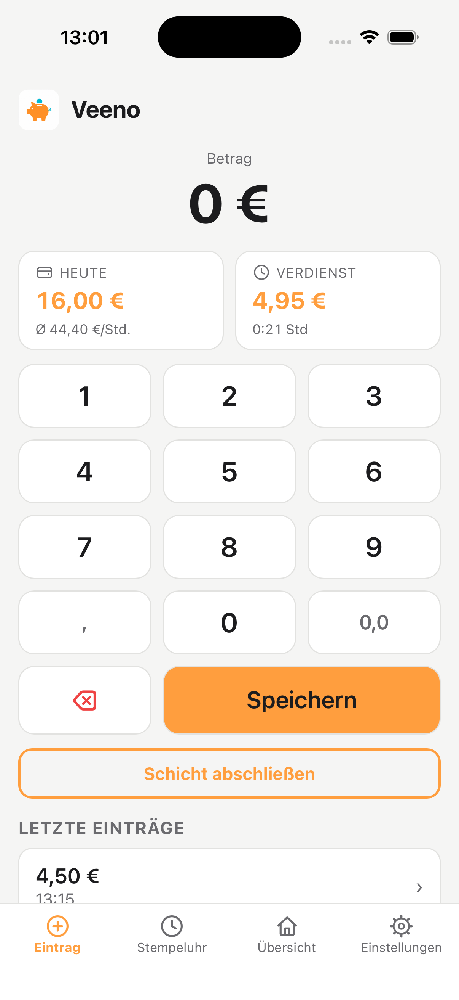
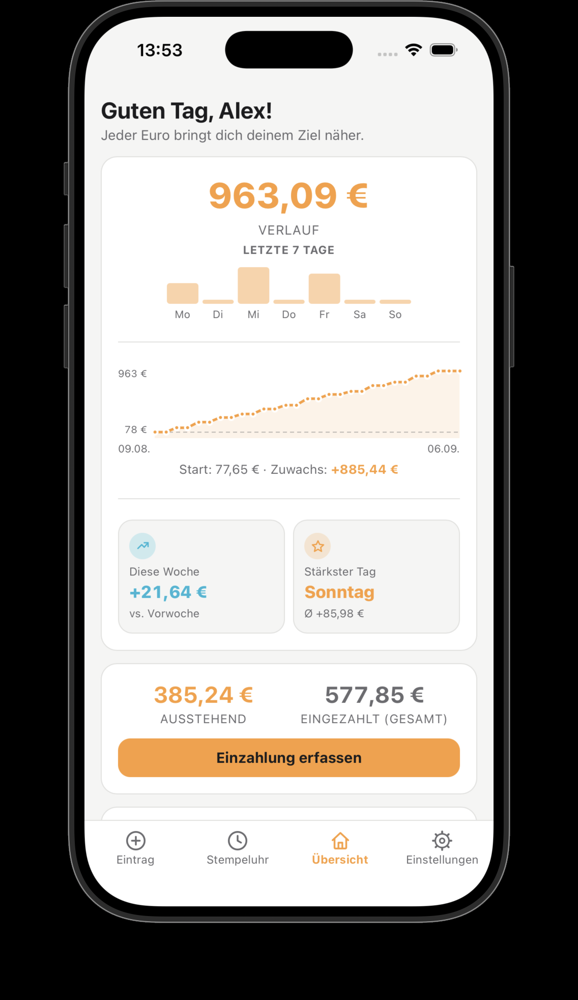
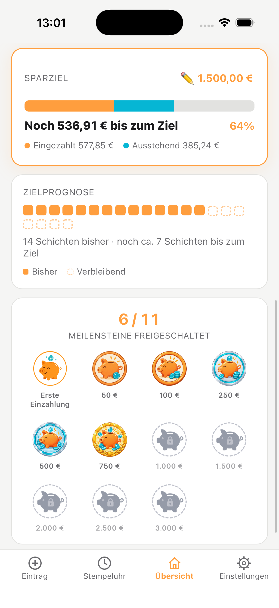
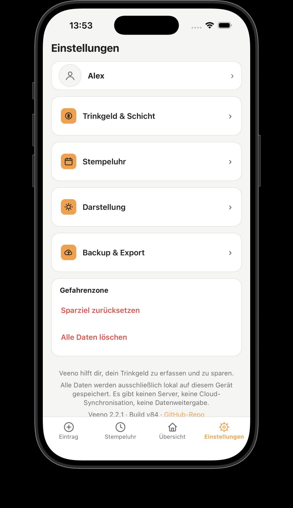

# Veeno 🐷

Eine schlanke Progressive Web App (PWA), um Trinkgeld direkt während der Schicht in
Sekunden festzuhalten – inklusive **Becher-Logik** (Scheine einzahlen, Kleingeld im
Becher lassen für die nächste Schicht) und **Sparrücklage-Tracking** für den
Studienstart.

**[→ Live-Demo](https://marviniee.github.io/Veeno/)**

|                                                    |                                                          |
| -------------------------------------------------- | -------------------------------------------------------- |
|          |            |
|  |  |

## Funktionen

- **Schneller Eintrag** über ein eigenes Zahlenfeld (Prefix-Logik) – ein Betrag ist in
  Sekunden getippt
- **Becher-Logik:** beim Schicht-Abschluss automatische Aufteilung in "Ausstehend"
  (volle Scheine, wandern zur Bank) und "Im Becher" (Kleingeld, bleibt für die nächste
  Schicht)
- **Ausstehend/Eingezahlt-Tracking:** behält im Blick, wie viel schon aus dem Becher
  entnommen, aber noch nicht am Bankautomaten eingezahlt wurde
- **Sparziel** mit Fortschrittsbalken bis zum gewünschten Zielbetrag
- **Zielprognose:** eigene Karte mit Kalender-Grid (Contribution-Graph-Stil), zeigt anhand
  des Durchschnitts der letzten 10 Schichten, in wie vielen weiteren Schichten das
  Sparziel voraussichtlich erreicht wird
- **Undo fürs Löschen:** kurzes Zeitfenster nach dem Löschen eines Eintrags, um die
  Aktion per Toast rückgängig zu machen
- **Wachstumskurve** der Sparrücklage über Zeit (1/3/6 Monate)
- **Meilenstein-Belohnungssystem** mit freischaltbaren Abzeichen ab der ersten
  Einzahlung bis zu 3.000 €
- **Backup & Restore:** alle Daten als JSON exportierbar und wiederherstellbar
- **Einstellungen** für Farbmodus (Hell/Dunkel/System), Rundungsgröße beim Schicht-
  Abschluss und Eingabe-Obergrenze pro Eintrag

## Technik

- Reines **HTML / CSS / JavaScript**, kein Framework, keine Abhängigkeiten
- **Lokale Speicherung** (localStorage) – alle Daten bleiben ausschließlich auf dem
  Gerät, kein Server, keine Cloud-Synchronisation, keine Datenweitergabe
- **Service Worker** für Offline-Nutzung
- Installierbar als **PWA** über „Zum Home-Bildschirm hinzufügen"

## Lokale Entwicklung

```bash
# im Projektordner einen einfachen Server starten
python3 -m http.server 8000
# dann im Browser öffnen:
# http://localhost:8000
```

## Lizenz

Persönliches Projekt, kein Open-Source-Lizenz – alle Rechte vorbehalten.

## Version

v1.1.0
